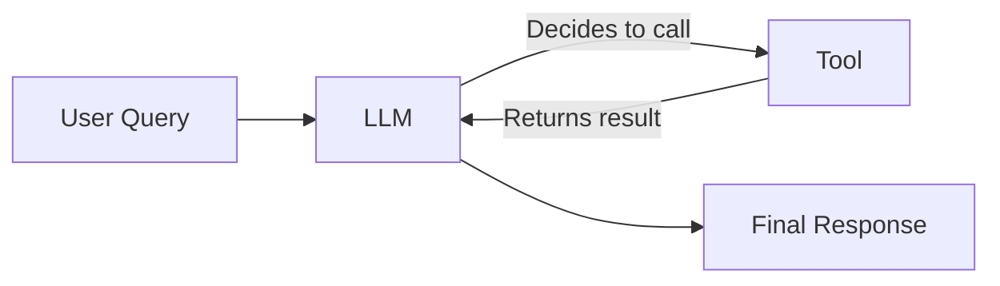
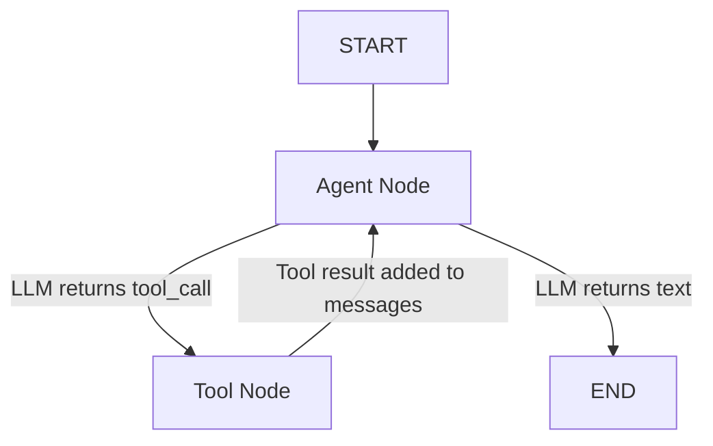

# How-To: Tool Implementation for Agents in LangGraph

A practical guide to implementing tools for LangGraph agents, covering both **Python (LangGraph)** and **Java (LangGraph4j + LangChain4j)**.

---

## What Are Tools?

Tools are **functions that an agent can invoke** to interact with the outside world — APIs, databases, search engines, code execution, etc. The LLM decides *when* and *which* tool to call based on the user's query and the tool's description.



> [!IMPORTANT]
> The **tool description** is what the LLM reads to decide whether to invoke it. A vague or misleading description leads to incorrect tool usage.

---

## Python (LangGraph) — Tool Implementation

### Step 1: Define a Tool

Use the `@tool` decorator from LangChain:

```python
from langchain_core.tools import tool

@tool
def search_database(query: str) -> str:
    """Search the company knowledge base for relevant documents.
    Use this when the user asks about company policies, products, or FAQs.
    Do NOT use for general knowledge questions."""
    # Your implementation here
    results = db.search(query)
    return format_results(results)
```

**Key points:**
- The **docstring** becomes the tool description the LLM sees
- **Type hints** on parameters are required — they define the tool's input schema
- Return type should be `str` (LLMs consume text)

### Step 2: Define Tools with Complex Inputs (Pydantic)

For tools with multiple or structured parameters:

```python
from langchain_core.tools import tool
from pydantic import BaseModel, Field

class MetricQuery(BaseModel):
    metric_name: str = Field(description="Metric to fetch, e.g. 'cpu.usage'")
    time_range_minutes: int = Field(description="Minutes of history", default=30)

@tool(args_schema=MetricQuery)
def fetch_metrics(metric_name: str, time_range_minutes: int) -> str:
    """Fetch monitoring metrics for a given metric name and time range."""
    return get_metrics(metric_name, time_range_minutes)
```

### Step 3: Bind Tools to the LLM

```python
from langchain_openai import ChatOpenAI

llm = ChatOpenAI(model="gpt-4o")
tools = [search_database, fetch_metrics]

# Bind tools — this tells the LLM about available tools
llm_with_tools = llm.bind_tools(tools)
```

### Step 4: Build the Agent Graph

```python
from langgraph.graph import StateGraph, MessagesState, START, END
from langgraph.prebuilt import ToolNode

# Create a ToolNode that automatically executes tool calls
tool_node = ToolNode(tools)

def agent_node(state: MessagesState):
    """The LLM decides whether to call a tool or respond directly."""
    response = llm_with_tools.invoke(state["messages"])
    return {"messages": [response]}

def should_continue(state: MessagesState):
    """Route: if the last message has tool calls, go to tools; otherwise end."""
    last_message = state["messages"][-1]
    if last_message.tool_calls:
        return "tools"
    return END

# Build the graph
graph = StateGraph(MessagesState)
graph.add_node("agent", agent_node)
graph.add_node("tools", tool_node)

graph.add_edge(START, "agent")
graph.add_conditional_edges("agent", should_continue, {"tools": "tools", END: END})
graph.add_edge("tools", "agent")  # After tool execution, go back to agent

app = graph.compile()
```

### Step 5: Run the Agent

```python
result = app.invoke({
    "messages": [{"role": "user", "content": "What is our leave policy?"}]
})
print(result["messages"][-1].content)
```

---

## Java (LangGraph4j + LangChain4j) — Tool Implementation

### Step 1: Define a Tool Class

Use `@Tool` and `@P` annotations from LangChain4j:

```java
import dev.langchain4j.agent.tool.P;
import dev.langchain4j.agent.tool.Tool;
import org.springframework.stereotype.Component;

@Component
public class AgentTools {

    @Tool("Search the knowledge base for company policies, FAQs, and product info. "
        + "Use ONLY for company-related queries.")
    public String searchKnowledgeBase(
            @P("The search query") String query
    ) {
        // Your implementation
        List<Result> results = ragService.search(query, 3);
        return formatResults(results);
    }

    @Tool("Analyze a code error or stack trace. Use when the user shares an "
        + "error message and wants debugging help.")
    public String analyzeCodeError(
            @P("The full error message or stack trace") String errorText
    ) {
        return "ERROR_TO_ANALYZE:\n" + errorText;
    }
}
```

**Key points:**
- `@Tool("description")` — the description the LLM reads to decide tool usage
- `@P("description")` — describes each parameter for the LLM
- Return `String` — the LLM consumes the result as text
- Use `@Component` for Spring dependency injection

### Step 2: Create the LLM with Tool Support

```java
import dev.langchain4j.model.chat.ChatLanguageModel;

@Configuration
public class AgentConfig {

    @Bean
    public ChatLanguageModel chatModel() {
        return OpenAiChatModel.builder()
                .apiKey(apiKey)
                .modelName("gpt-4o")
                .build();
    }
}
```

### Step 3: Build the Agent Graph

```java
import org.bsc.langgraph4j.StateGraph;
import org.bsc.langgraph4j.action.EdgeAction;

public StateGraph<AgentState> buildGraph(AgentTools tools) {

    // Create the LLM node
    var callModel = (NodeAction<AgentState>) state -> {
        var response = chatModel.generate(state.messages());
        return Map.of("messages", List.of(response.content()));
    };

    // Create the tool execution node
    var executeTool = (NodeAction<AgentState>) state -> {
        var lastMessage = state.lastMessage();
        // Execute the tool call and return result
        var toolResult = executeToolCall(lastMessage, tools);
        return Map.of("messages", List.of(toolResult));
    };

    // Routing logic
    EdgeAction<AgentState> shouldContinue = state -> {
        var lastMessage = state.lastMessage();
        if (lastMessage.hasToolCalls()) {
            return "tools";
        }
        return "end";
    };

    return new StateGraph<>(AgentState::new)
            .addNode("agent", callModel)
            .addNode("tools", executeTool)
            .addEdge(START, "agent")
            .addConditionalEdges("agent", shouldContinue,
                    Map.of("tools", "tools", "end", END))
            .addEdge("tools", "agent");
}
```

---

## Best Practices for Tool Descriptions

The **tool description is the most important part** — it directly impacts whether the LLM uses the tool correctly.

| ✅ Do | ❌ Don't |
|---|---|
| Be specific about *when* to use the tool | Use vague descriptions like "searches stuff" |
| Include example inputs in the description | Leave parameter descriptions empty |
| State what the tool should NOT be used for | Assume the LLM will figure it out |
| Keep descriptions concise but complete | Write multi-paragraph descriptions |

### Good vs Bad Examples

```diff
- @Tool("Gets data")
+ @Tool("Fetch CPU and memory metrics for a given service over a
+  specified time range. Use when investigating performance alerts.")

- @P("input")
+ @P("The service name, e.g., 'ecommerce-app' or 'payment-service'")
```

---

## Common Tool Patterns

### 1. API Wrapper Tool
Wraps an external API call (e.g., fetching data from Datadog, Jira, Slack):

```python
@tool
def get_jira_ticket(ticket_id: str) -> str:
    """Fetch details of a Jira ticket by its ID (e.g., 'PROJ-123')."""
    response = requests.get(f"{JIRA_URL}/rest/api/2/issue/{ticket_id}")
    return json.dumps(response.json(), indent=2)
```

### 2. Database Query Tool
Runs a query against a database:

```python
@tool
def query_user_data(user_id: str) -> str:
    """Look up user profile and recent activity by user ID."""
    user = db.users.find_one({"id": user_id})
    return json.dumps(user)
```

### 3. RAG / Knowledge Base Tool
Searches a vector store for relevant documents:

```python
@tool
def search_docs(query: str) -> str:
    """Search internal documentation for relevant information."""
    docs = vector_store.similarity_search(query, k=3)
    return "\n\n".join([d.page_content for d in docs])
```

### 4. Code Execution Tool
Runs code or shell commands:

```python
@tool
def run_python(code: str) -> str:
    """Execute Python code and return the output. Use for calculations."""
    result = exec_sandbox(code)
    return result.stdout
```

---

## The Tool Execution Loop

This is the fundamental pattern every LangGraph agent follows:



1. **Agent Node** — The LLM processes messages and either responds with text or requests a tool call
2. **Router** — Checks if the LLM's response contains tool calls
3. **Tool Node** — Executes the requested tool and appends the result to messages
4. **Loop Back** — The LLM sees the tool result and decides the next step

> [!TIP]
> The agent can call **multiple tools in sequence** before giving a final answer. Each tool result is appended to the message history, giving the LLM full context.

---

## Debugging Tips

1. **Tool not being called?** → Check the tool description. The LLM may not understand when to use it.
2. **Wrong tool called?** → Tool descriptions may overlap. Make each tool's purpose distinct.
3. **Tool result ignored?** → The returned string may be too long or unstructured. Keep tool outputs concise and formatted.
4. **Infinite loop?** → Add a max iterations limit to your graph or a stop condition in the routing logic.

```python
# Add recursion limit to prevent infinite loops
app.invoke({"messages": [...]}, config={"recursion_limit": 10})
```

---

## Quick Reference

| Concept | Python (LangGraph) | Java (LangGraph4j) |
|---|---|---|
| Define a tool | `@tool` decorator | `@Tool` annotation |
| Parameter description | Docstring + type hints | `@P("description")` |
| Bind tools to LLM | `llm.bind_tools(tools)` | Pass tools to model config |
| Execute tools | `ToolNode(tools)` | Custom tool execution node |
| Routing | `tool_calls` check | `hasToolCalls()` check |
